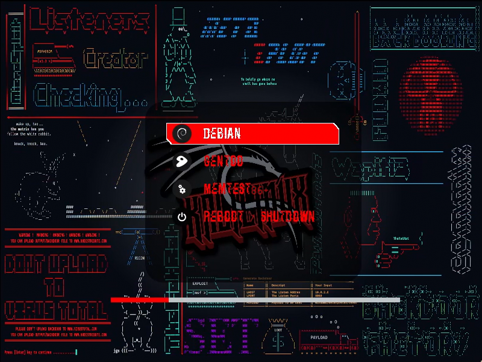
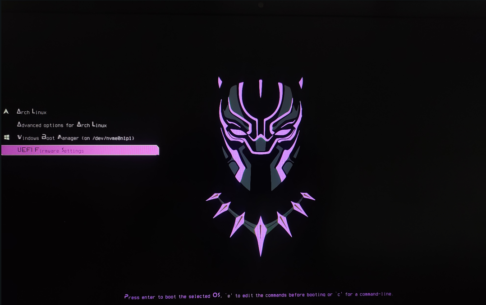

## Boot-Menu Themes

### Usage

Download or clone this repository, and make the `update_grub_theme.sh` file executable. Then run that script.

|                                  |                                           |                                       |
| :------------------------------: | :---------------------------------------: | :-----------------------------------: |
|  |  |  |
|           **Samurai**            |               **Kali-Red**                |           **Black Panther**           |
